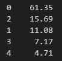
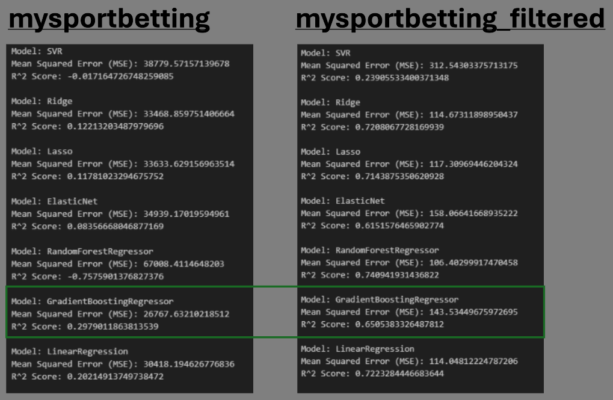
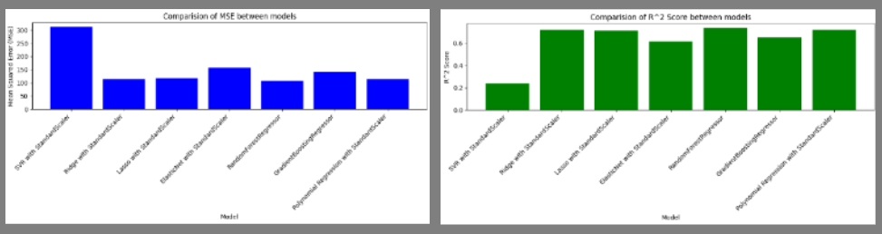

# **Online Sports Bettings**

  

 This is a project related to Online Sports Betting in Spain where the aim is to obtain a model that predicts the sports group that brings the most profit to a company given a sample data set. 

## **Table of Contents**

 1. [Streamlit App](#Streamlit-App)
 2. [User Guide](User-Guide)
 3. [Files & Description](Files-&-Description)
 4. [Main Challenges](Main-Challenges)
 4. [Key Results](Key-Results)
 5. [Contributing](Contributing)

### **Streamlit App**

A Streamlit application has been created to show some of the results obtained during this project. It can be accessed directly from [Online Sports Betting](https://online-sports-bettings-kbrepywzhd5mjvfpihsmsb.streamlit.app/).    
  
This is a multi-tab application where you can browse through different information on each tab.     
  - Tabs & Content:     

    - Context: This tab provides an overview of the number of Online Sportbetting houses in Spain and their ratings. It has a filter to display them according to the rating of the public.       
    - Events Distribution: This tab shows the number of events (competitions) on which bets have been placed during the period recorded in the dataset used in the project.     
    - Wager vs Win: Overview and comparison of the amount bet by the players and the amount earned by the company. By using filters, some more concrete data can be displayed.      
    - PowerBI: A PowerBI panel with different statistics has been added in this Tab. It can also be consulted [PowerBI](https://app.fabric.microsoft.com/view?r=eyJrIjoiZTIyMjcxNjktZGExMS00MDljLWJmMjYtYzFiZDMzMmZhMDZiIiwidCI6IjhhZWJkZGI2LTM0MTgtNDNhMS1hMjU1LWI5NjQxODZlY2M2NCIsImMiOjl9&pageName=ReportSection).     
    - Prediction: In this tab you can predict the company's profit by specifying a sport group and the time of purchase of the bet.       

### **📋User Guide**

#### Replicate the application  

  It's easy! Just copy this repository and use your Streamlit Share account.  
 
#### Modify application elements 

- Streamlit Local Host  

  - Open the repository in Visual Studio Code.  
  - Open the Terminal by pressing Ctrl+J or from the top right menu.  
  - Type in the Terminal "Streamlit run app.py". If necessary, replace "app.py" with the relative path of the application's main .py file.  
  - Once the app is visualised in Streamlit Local, you can start applying changes and improvements. Always from the application's .py files.  
  - Whenever you save a change in Visual Studio Code, you will have to refresh Streamlit to be able to see the applied changes. 

- Share Streamlit 

  - Make a copy of the repository on your GitHub. 
  - Open the repository in Visual Studio Code.  
  - Log in to your Share Streamlit account. 
  - Select "New app". 
  - Choose the repository containing the application. 
  - Click the "Deploy!" button. 
  - Make sure that the versions in the requirements.txt file match the ones you have in your version of Visual Studio Code. If not, update them to avoid errors.  
  - Once the app is visualised in Share Streamlit, you can start applying changes and improvements. Always from the application's .py files.  
  - Whenever you save a change in Visual Studio Code, you will have to refresh Streamlit to be able to see the applied changes. 

### **🗃️Files & Description**

- [App](app.py)
  - Creation of an app with different tabs that reflect different statics, results and contain a prdiction model.
- [Notebooks](Notebooks)
  - [Webscrapping](Notebooks\Webscrapping_Betting_Houses.ipynb)
    - Obtaining updated data on the different Spanish Betting Houses and their valuation. 
  - [Preprocesing & EDA](Notebooks\Data_Pre-Processing_&_EDA.ipynb)
    - Uploading dataset and querying its attributes.
    - Study of the different variables.
    - Testing normality.
    - Creation of new columns for further study.
    - Null values detection & treatment.
    - Correlation studies and tests.
    - Normalisation.
    - Outliers detection & treatment.
    - Creation of new cvs for analysis and Machine Learning purposes.
  - [Data Analysis](Notebooks\Data_Analysis_Graphs.ipynb)
    - Events Distribution by different variables.
    - Wager Distribution by different variables.
    - Win Distribution by different variables.
  - [Regression Model](Notebooks\Regression_model_Winnings.ipynb)
- [Requirements](requirements.txt)
- [Data](Data)
  - Contains the different cvs used on present proyect and a copy of them on excel. 
- [Images](Images)
  - Contains the different imagesused on the present proyect. 

### **🗃️Main Challenges**

  - Webscrapping: 
    - To access any Spanish site related to gambling, it is necessary to confirm that you are over 18 years of age.
    - It was necessary to automate the web browser using a webdriver to locate the age botton and provide waiting time to click as "yes" in order to acces the information. 
    - `Selenium` was used to this purpose. 
  - Preprocesing & EDA:
    - Correlation 
      - As the variables do not follow a Gaussian distribution, Spearman or Kendall provide better data than Pearson. In this project, `Spearman` was used.
      - `Label encode` was used to codify object variables and to observe the possible correlations between numerical and object variables. 
    - Outliers
      - Were calculated using `IQR` and the number extracted was very high.
      - Outliers were summed per line based on the numeral variables identified as outliers and, were all 4 numerical variables were identified as outlier, were removed. In this case, 4.71% of the entries were removed.    

      

    - Normalisation 
      - Before removing Outliers, normalisation was applied with `RobustScaler`.
      - Data do not follow a Gaussioan distribution and has a high number of outliers, reasons why "Z-Score", "Min-Max" were discard. Box-Cox was also discard as the robustness of the data is more important in this case than to fit to a normal distribution. 

  - Regression Model:     
    - Different models have been trained: `Support Vector Regression(SVR)`, `Ridge Regression`, `Lasso Regression`, `ElasticNet Regression`, `Random Forest Regression`, `Gradient Boosting Regression` and `Polynomial Regression`.   
    - Train was applied to data with normalization applied and outliers removed (mysportsbettings_filtered) but also without this changes (mysportsbetting).   
    - Better model results come from `Random Forest Regression` applied to data with normalisation and without outliers.   
         
      
    - Although Random Forest Regression is the best of the models we tested, it still has a very high MSE and, when compared to real data, we found that it is not a good prediction model. The margin of error is very high. 
    - Finally, Azure Automated ML has been used to get a better model. 
    - After train models with mysportsbetting and mysportsbetting_filtered, best results comes with mysportsbetting_filtered (data normalizated and part of the outliers removed).
    - `green_holiday_tlwygl89` model, as is the one that offers the best predictions and the one used to make predictions. 

  

   

 
### **🎯Key Results**
  - Our dataset contains wager amounts by event (competitions). Don't include bets by user so our conclusions will always be around events. 
  - The strongest correlation is the negative (inverse) correlation between "Paid" and "Hold" (-0.97). The more you pay, the less the company earns.
  - Sports betting has a great variability in the amounts wagered. They depend on factors such as the sport, the specific event or the players themselves. In terms of events and sports, some are more popular than others, in general, but as far as players are concerned, there is no rule that marks the level of their bets.
  - The most popular sport and the one who provides a major profit is football.
  - Football competitions are the ones that generate the most money for the company, but they are also the ones in which users are paid the most money. 

### **Contributing**

  Contributions to this project are welcome. If you find any bugs or have any suggestions for improvement, feel free to open an Issue or send a Pull Request.

